# 🗳️ Advanced Voting System with NFT Integration

A sophisticated blockchain-based voting system built with Solidity, featuring NFT-based voting rights, random winner selection, and automated vote management.

## 🌟 Features

### Core Voting System
- **Multiple Options**: Support for any number of voting options
- **Vote Changing**: Voters can change their vote before the voting period ends
- **Duplicate Prevention**: Built-in protection against duplicate voting
- **Winner Determination**: Automatic winner calculation based on vote counts

### NFT Integration
- **Transferable NFT**: ERC-721 tokens that can be traded and grant voting rights
- **Soulbound NFT**: ERC-5192 compliant non-transferable tokens for permanent voting rights
- **Voting Power**: Customizable voting power per NFT token
- **Automatic Rights Management**: Voting rights automatically granted/revoked on NFT transfers

### Advanced Features
- **Random Winner Selection**: Chainlink VRF integration for verifiable random winner selection
- **Automated Vote Management**: Chainlink Automation for automatic vote ending
- **Factory Pattern**: Easy deployment of multiple voting instances
- **Event Logging**: Comprehensive event system for tracking all activities

## 📋 System Architecture

### Smart Contracts Overview

| Contract | Purpose | Type |
|----------|---------|------|
| `Vote.sol` | Core voting logic | Main Contract |
| `VoteFactory.sol` | Creates new voting instances | Factory |
| `TransferableNFT.sol` | ERC-721 voting rights tokens | NFT |
| `SoulboundNFT.sol` | ERC-5192 non-transferable tokens | NFT |
| `Chainlink.sol` | Random number generation & automation | Integration |
| `INFTVoting.sol` | Interface for NFT voting contracts | Interface |

### 🔄 Sequence Diagram
The following diagram shows the complete voting flow from creation to winner selection:

```mermaid
sequenceDiagram
    participant User as "👤 User"
    participant Factory as "🏭 VoteFactory"
    participant Vote as "🗳️ Vote Contract"
    participant NFT as "🎫 NFT Contract"
    participant Chainlink as "🔗 Chainlink"
    
    Note over User,Chainlink: Voting System Sequence Flow
    
    User->>Factory: createVote(name, description, options, duration)
    Factory->>NFT: deploy TransferableNFT/SoulboundNFT
    NFT-->>Factory: nftAddress
    Factory->>Chainlink: deploy ChainlinkIntegration
    Chainlink-->>Factory: chainlinkAddress
    Factory->>Vote: deploy Vote(params, nftAddress, chainlinkAddress)
    Vote-->>Factory: voteAddress
    Factory-->>User: voteAddress
    
    Note over User,Vote: Voting Phase
    
    User->>Vote: vote(optionNumber)
    Vote->>NFT: addHolder(userAddress)
    NFT-->>Vote: tokenId
    Vote-->>User: VotedEvent(user, choice)
    
    Note over User,Vote: Vote Change (Optional)
    
    User->>Vote: changevote(newOption)
    Vote->>Vote: updateVoteRecords()
    Vote-->>User: VoteChangedEvent(user, fromChoice, toChoice)
    
    Note over Vote,Chainlink: Automated Vote Ending
    
    Chainlink->>Vote: checkUpkeep()
    Vote-->>Chainlink: upkeepNeeded=true
    Chainlink->>Vote: performUpkeep()
    Vote->>Chainlink: requestRandomWinner()
    Chainlink-->>Vote: fulfillRandomWords(randomNumber)
    Vote->>Vote: processRandomWinner(randomNumber)
    Vote->>NFT: returnWinner(winnerAddress)
    NFT->>NFT: updateWinnerMetadata()
    Vote-->>User: VoteEndedEvent(winner)
```



*This shows the interaction between users, contracts, and external services throughout the entire voting lifecycle.*

### 🏗️ Class Diagram
The system architecture and contract relationships:


*This illustrates the inheritance hierarchy, interface implementations, and composition relationships between all contracts.*

## 🛠️ Prerequisites

- Node.js v16+ (Note: v21.7.2 has compatibility warnings with Hardhat)
- npm or yarn
- Git

## ⚙️ Installation & Setup

### 1. Clone the Repository
```bash
git clone <repository-url>
cd Vote_solidity
```

### 2. Install Dependencies
```bash
npm install
```

### 3. Environment Setup
Create a `.env` file in the root directory:
```env
PRIVATE_KEY=your_private_key_here
INFURA_PROJECT_ID=your_infura_project_id
ETHERSCAN_API_KEY=your_etherscan_api_key
```

### 4. Compile Contracts
```bash
npx hardhat compile
```

## 🚀 Deployment

### 📊 Deployment Architecture
The deployment process follows a structured approach:

```mermaid
flowchart TD
    A[📋 Start Deployment] --> B{Environment?}
    
    B -->|Local| C[🚀 Start Hardhat Node]
    B -->|Testnet| D[🌐 Configure Network]
    B -->|Mainnet| E[⚠️ Production Setup]
    
    C --> F[📝 Compile Contracts]
    D --> F
    E --> F
    
    F --> G[🔧 Deploy Chainlink Integration]
    G --> H[🎫 Deploy NFT Contracts]
    H --> I{NFT Type?}
    
    I -->|Transferable| J[📦 Deploy TransferableNFT]
    I -->|Soulbound| K[🔒 Deploy SoulboundNFT]
    I -->|Both| L[📦🔒 Deploy Both Types]
    
    J --> M[🏭 Deploy VoteFactory]
    K --> M
    L --> M
    
    M --> N[🗳️ Create First Vote]
    N --> O[✅ System Ready]
    
    O --> P[🧪 Run Tests]
    P --> Q{Tests Pass?}
    
    Q -->|✅ Yes| R[🎉 Deployment Complete]
    Q -->|❌ No| S[🔍 Debug Issues]
    S --> F
    
    R --> T[📊 Monitor & Manage]
    
    style A fill:#e1f5fe
    style R fill:#c8e6c9
    style S fill:#ffcdd2
    style O fill:#fff3e0
    style T fill:#f3e5f5
```



*This flowchart shows the complete deployment process from initial setup to production monitoring.*

### Local Development Network

1. **Start Hardhat Node**:
```bash
npx hardhat node
```
This will start a local blockchain with 20 test accounts, each funded with 10,000 ETH.

2. **Deploy Contracts**:
```bash
npx hardhat run deploy.js --network localhost
```

3. **Run Tests**:
```bash
# Run simplified test (without complex integrations)
node simple-test.js

# Run full test suite
npx hardhat run test.js --network localhost
```

### 📝 Step-by-Step Deployment Guide

#### Quick Start (5 minutes)
```bash
# 1. Install dependencies
npm install

# 2. Compile contracts
npx hardhat compile

# 3. Start local node (in separate terminal)
npx hardhat node

# 4. Run simple test
node simple-test.js
```

#### Full Deployment (Complete System)
```bash
# 1. Deploy all contracts with full integration
npx hardhat run deploy.js --network localhost

# 2. Run comprehensive tests
npx hardhat run test.js --network localhost
```

### Testnet Deployment

#### Sepolia Testnet
```bash
npx hardhat run deploy.js --network sepolia
```

#### Polygon Mumbai Testnet
```bash
npx hardhat run deploy.js --network mumbai
```

## 📊 Usage Examples

### Basic Voting
```javascript
const { ethers } = require("hardhat");

// Deploy a new vote
const Vote = await ethers.getContractFactory("Vote");
const vote = await Vote.deploy(
    "Best Programming Language",
    "Vote for your favorite programming language",
    3, // 3 options
    ethers.ZeroAddress, // No NFT contract for basic voting
    ethers.ZeroAddress, // No Chainlink integration
    24, // 24 hours duration
    false // No random winner
);

// Cast a vote
await vote.connect(voter).vote(1); // Vote for option 1

// Change vote
await vote.connect(voter).changevote(2); // Change to option 2

// Get results
const results = await vote.TotalVoteRecordGetter();
const winner = await vote.determineWinner();
```

### Factory-based Deployment
```javascript
const VoteFactory = await ethers.getContractFactory("VoteFactory");
const factory = await VoteFactory.deploy();

// Create a new vote through factory
await factory.createVote(
    "Community Decision",
    "Important community decision",
    2, // Yes/No vote
    24 // 24 hours
);

// Get all created votes
const allVotes = await factory.getAllVotes();
```

## 🧪 Testing

### Test Scripts Available

1. **simple-test.js**: Basic voting functionality test (no NFT/Chainlink)
2. **nft-test.js**: Comprehensive NFT voting system test ⭐ **NEW**
3. **test.js**: Full test suite with all integrations
4. **deploy.js**: Complete deployment script with all contracts

### Running Tests
```bash
# Simple test (recommended for first run)
node simple-test.js

# NFT voting test (demonstrates NFT integration) ⭐ 
node nft-test.js

# Full test suite with all features
npx hardhat run test.js --network localhost

# Deploy all contracts
npx hardhat run deploy.js --network localhost
```

### 🎫 NFT Test Results
The NFT integration test demonstrates:

✅ **Transferable NFT Features:**
- Automatic NFT minting when users vote
- Voting rights transfer with NFT ownership
- Custom voting power per NFT (1x, 3x, 5x, 10x)
- Batch minting functionality

✅ **Soulbound NFT Features:**
- Permanent voting rights (non-transferable)
- Transfer prevention (ERC-5192 compliance)
- Lifetime membership tokens

✅ **Integration Results:**
- Vote Contract 1: `0x9fE46736679d2D9a65F0992F2272dE9f3c7fa6e0`
- Vote Contract 2: `0x5FC8d32690cc91D4c39d9d3abcBD16989F875707`
- TransferableNFT: `0x5FbDB2315678afecb367f032d93F642f64180aa3`
- SoulboundNFT: `0xDc64a140Aa3E981100a9becA4E685f962f0cF6C9`

## 📁 Project Structure

```
Vote_solidity/
├── src/                    # Smart contracts
│   ├── Vote.sol           # Core voting contract
│   ├── VoteFactory.sol    # Factory for creating votes
│   ├── TransferableNFT.sol # ERC-721 voting rights
│   ├── SoulboundNFT.sol   # ERC-5192 soulbound tokens
│   ├── Chainlink.sol      # Chainlink integration
│   └── INFTVoting.sol     # Interface
├── test/                   # Test files
├── deploy.js              # Deployment script
├── test.js               # Full test suite
├── simple-test.js        # Basic voting test
├── nft-test.js           # NFT integration test ⭐
├── package.json          # Dependencies
├── hardhat.config.js     # Hardhat configuration
└── README.md             # This file
```

## 🔧 Configuration

### Hardhat Configuration
The project supports multiple networks:
- **localhost**: Local development (default)
- **sepolia**: Ethereum Sepolia testnet
- **mumbai**: Polygon Mumbai testnet

### Solidity Versions
- Primary: ^0.8.20 (compatible with OpenZeppelin v5.0.0)
- Fallback: ^0.8.18 (for legacy compatibility)

## 🎯 Key Functions

### Vote Contract
- `vote(uint8 _choice)`: Cast a vote for an option
- `changevote(uint8 _choice)`: Change your existing vote
- `TotalVoteRecordGetter()`: Get vote counts for each option
- `determineWinner()`: Get the winning option
- `rewardWinner()`: Trigger winner selection and rewards

### VoteFactory Contract
- `createVote(...)`: Create a new voting instance
- `getAllVotes()`: Get all created vote addresses
- `getVotesByCreator(address)`: Get votes by specific creator

### NFT Contracts
- `addHolder(address)`: Grant voting rights via NFT
- `returnWinner(address)`: Mark winner and update NFT metadata
- `hasVotingRights(address)`: Check if address has voting rights

## 🔍 Events

The system emits various events for tracking:
- `Voted(address voter, uint8 choice)`
- `VoteChanged(address voter, uint8 fromChoice, uint8 toChoice)`
- `HolderAdded(address holder, uint256 tokenId)`
- `WinnerRewarded(address winner, uint256 tokenId)`

## 🐛 Troubleshooting

### Common Issues

1. **Node.js Version Warning**: Use Node.js v16-v18 for best compatibility
2. **Compilation Errors**: Ensure all dependencies are installed with `npm install`
3. **Network Issues**: Check your `.env` file for correct API keys
4. **Gas Estimation Errors**: Increase gas limit in hardhat.config.js

### Debug Commands
```bash
# Verbose compilation
npx hardhat compile --verbose

# Show stack traces on errors
npx hardhat run script.js --show-stack-traces

# Clean build cache
npx hardhat clean
```

## 🤝 Contributing

1. Fork the repository
2. Create a feature branch
3. Make your changes
4. Test thoroughly
5. Submit a pull request

## 📄 License

This project is licensed under the MIT License.

## 🔗 Links

- [Hardhat Documentation](https://hardhat.org/docs)
- [OpenZeppelin Contracts](https://docs.openzeppelin.com/contracts)
- [Chainlink Documentation](https://docs.chain.link/)
- [Solidity Documentation](https://docs.soliditylang.org/)

---

Built with ❤️ using Solidity, Hardhat, and OpenZeppelin
