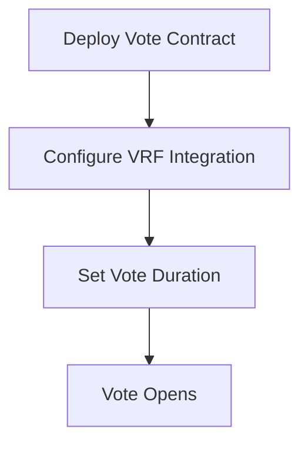
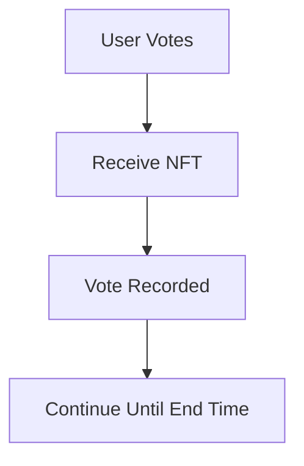
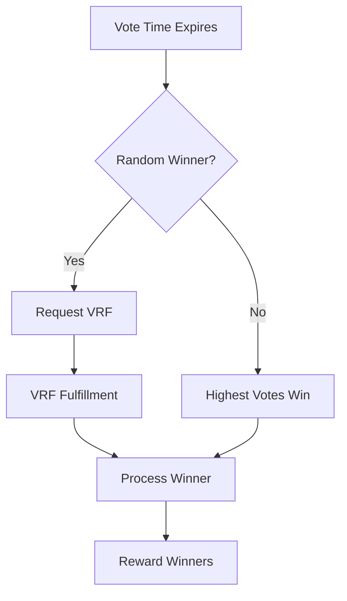

# Chainlink VRF Integration Guide

## Overview

This guide covers the Chainlink VRF (Verifiable Random Function) integration for the blockchain voting system. The implementation provides both **mock VRF** for development/testing and **real VRF** for production deployment.

## 🎯 Features

### Mock VRF Integration (`ChainlinkIntegration.sol`)
- ✅ Fast development and testing
- ✅ No external dependencies
- ✅ Immediate random number generation
- ✅ No cost for testing
- ❌ Not truly random (predictable)
- ❌ Not suitable for production

### Real VRF Integration (`ChainlinkVRF.sol`)
- ✅ Cryptographically secure randomness
- ✅ Verifiable on-chain
- ✅ Production-ready
- ✅ Tamper-proof
- ✅ Industry standard
- ❌ Requires LINK tokens
- ❌ Network-dependent
- ❌ Slight delay for fulfillment

## 📁 File Structure

```
src/
├── Chainlink.sol          # Mock VRF integration
├── ChainlinkVRF.sol       # Real VRF integration
├── MockVRFCoordinator.sol # Mock coordinator for testing
└── Vote.sol               # Vote contract with VRF support

tests/
└── vrf-test.js            # Comprehensive VRF testing

scripts/
└── deploy-vrf.js          # VRF deployment script
```

## 🔧 Mock VRF Integration

### Usage for Development

```javascript
// Deploy mock Chainlink integration
const ChainlinkIntegration = await ethers.getContractFactory("ChainlinkIntegration");
const mockChainlink = await ChainlinkIntegration.deploy();

// Deploy vote with mock VRF
const vote = await Vote.deploy(
    "Test Vote",
    "Testing with mock VRF",
    3, // options
    nftAddress,
    await mockChainlink.getAddress(),
    24, // hours
    true // use random winner
);
```

### Mock Random Generation

The mock VRF generates pseudo-random numbers using:
```solidity
uint256 randomNumber = uint256(keccak256(abi.encodePacked(
    block.timestamp, 
    block.prevrandao, 
    voteContract,
    requestId
)));
```

## 🎯 Real VRF Integration

### Prerequisites

1. **Chainlink VRF Subscription**
   - Create subscription at [vrf.chain.link](https://vrf.chain.link/)
   - Fund with LINK tokens
   - Note your subscription ID

2. **Network Configuration**
   - Sepolia: `0x8103B0A8A00be2DDC778e6e7eaa21791Cd364625`
   - Mumbai: `0x7a1BaC17Ccc5b313516C5E16fb24f7659aA5ebed`
   - Mainnet: `0x271682DEB8C4E0901D1a1550aD2e64D568E69909`

### Environment Setup

Create `.env` file:
```bash
VRF_SUBSCRIPTION_ID=123
PRIVATE_KEY=your_private_key
SEPOLIA_RPC_URL=your_sepolia_url
```

### Deployment

```bash
# Deploy to localhost (mock)
npx hardhat run scripts/deploy-vrf.js --network localhost

# Deploy to Sepolia (real VRF)
npx hardhat run scripts/deploy-vrf.js --network sepolia
```

### Production Usage

```javascript
// Deploy real VRF integration
const ChainlinkVRF = await ethers.getContractFactory("ChainlinkVRF");
const chainlinkVRF = await ChainlinkVRF.deploy(
    subscriptionId,
    vrfCoordinatorAddress,
    keyHash
);

// Add consumer to subscription
// (Done manually in Chainlink dashboard)

// Deploy vote with real VRF
const vote = await Vote.deploy(
    "Production Vote",
    "Real VRF voting",
    4, // options
    nftAddress,
    await chainlinkVRF.getAddress(),
    48, // hours
    true // use random winner
);
```

## 🔄 Vote Flow with VRF

### 1. Vote Creation


### 2. Voting Process


### 3. Vote Ending & Winner Selection


## 🧪 Testing

### Run All VRF Tests
```bash
node tests/vrf-test.js
```

### Test Coverage

1. **Mock Chainlink Integration**
   - Basic voting functionality
   - Random winner selection
   - Automation testing

2. **Real VRF Structure**
   - Contract deployment
   - Configuration validation
   - Interface compatibility

3. **Automation Testing**
   - Time-based vote ending
   - Automatic upkeep
   - Winner determination

4. **Comparative Analysis**
   - Mock vs Real VRF comparison
   - Randomness quality analysis
   - Production recommendations

## ⚙️ Configuration

### VRF Parameters

```solidity
struct VRFConfig {
    uint256 subscriptionId;     // Chainlink subscription ID
    bytes32 keyHash;           // Gas lane identifier
    uint32 callbackGasLimit;   // Gas for fulfillment
    uint16 requestConfirmations; // Block confirmations
    uint32 numWords;           // Number of random values
}
```

### Network-Specific Settings

#### Sepolia Testnet
```javascript
{
    subscriptionId: process.env.VRF_SUBSCRIPTION_ID,
    keyHash: "0x474e34a077df58807dbe9c96d3c009b23b3c6d0cce433e59bbf5b34f823bc56c", // 30 gwei
    vrfCoordinator: "0x8103B0A8A00be2DDC778e6e7eaa21791Cd364625"
}
```

#### Mumbai Testnet
```javascript
{
    subscriptionId: process.env.VRF_SUBSCRIPTION_ID,
    keyHash: "0x4b09e658ed251bcafeebbc69400383d49f344ace09b9576fe248bb02c003fe9f", // 500 gwei
    vrfCoordinator: "0x7a1BaC17Ccc5b313516C5E16fb24f7659aA5ebed"
}
```

#### Ethereum Mainnet
```javascript
{
    subscriptionId: process.env.VRF_SUBSCRIPTION_ID,
    keyHash: "0x8af398995b04c28e9951adb9721ef74c74f93e6a478f39e7e0777be13527e7ef", // 200 gwei
    vrfCoordinator: "0x271682DEB8C4E0901D1a1550aD2e64D568E69909"
}
```

## 🔐 Security Considerations

### Mock VRF Vulnerabilities
- **Predictable randomness**: Uses blockchain data that can be predicted
- **Manipulation risk**: Miners can influence block.timestamp and block.prevrandao
- **Not production-safe**: Should never be used for mainnet deployments

### Real VRF Security
- **Cryptographically secure**: Uses verifiable random functions
- **Tamper-proof**: Cannot be manipulated by miners or validators
- **Verifiable**: Each random number comes with a cryptographic proof

## 📊 Performance Comparison

| Feature | Mock VRF | Real VRF |
|---------|----------|----------|
| Speed | Instant | 1-3 blocks |
| Cost | Free | ~0.25 LINK |
| Security | Low | High |
| Verifiability | None | Full |
| Production Ready | No | Yes |

## 🚀 Production Deployment Checklist

### Pre-deployment
- [ ] Create Chainlink VRF subscription
- [ ] Fund subscription with LINK tokens
- [ ] Configure network-specific parameters
- [ ] Test on testnet first

### Deployment
- [ ] Deploy ChainlinkVRF contract
- [ ] Add contract as consumer to subscription
- [ ] Deploy Vote contracts with VRF integration
- [ ] Configure automation (optional)

### Post-deployment
- [ ] Verify contract on block explorer
- [ ] Test VRF functionality
- [ ] Monitor LINK token balance
- [ ] Set up monitoring/alerts

## 🔗 Useful Links

- [Chainlink VRF Documentation](https://docs.chain.link/vrf/v2/introduction)
- [VRF Subscription Management](https://vrf.chain.link/)
- [Chainlink Automation](https://automation.chain.link/)
- [LINK Token Faucets](https://faucets.chain.link/)

## 🛠️ Troubleshooting

### Common Issues

#### "Subscription not found"
- Verify subscription ID is correct
- Ensure subscription is funded
- Check network configuration

#### "Consumer not added"
- Add contract address to VRF subscription
- Wait for transaction confirmation
- Verify consumer list in dashboard

#### "Insufficient LINK balance"
- Fund subscription with LINK tokens
- Check current balance in dashboard
- Monitor usage patterns

#### "VRF request failed"
- Check gas limits
- Verify key hash for network
- Ensure proper confirmations

### Debug Commands

```bash
# Check VRF configuration
npx hardhat console --network sepolia
> const vrf = await ethers.getContractAt("ChainlinkVRF", "CONTRACT_ADDRESS")
> await vrf.getSubscriptionId()
> await vrf.getKeyHash()

# Test VRF request
> await vrf.requestRandomWinner("VOTE_CONTRACT_ADDRESS")
```

## 📈 Monitoring

### Key Metrics
- VRF request frequency
- Fulfillment success rate
- LINK token consumption
- Gas usage patterns

### Recommended Monitoring
- Set up balance alerts for LINK tokens
- Monitor VRF request/fulfillment events
- Track vote contract interactions
- Set up uptime monitoring for automation

---

## 🎉 Summary

The VRF integration provides a robust solution for secure random number generation in the voting system. Use mock VRF for development and testing, then deploy with real VRF for production to ensure cryptographically secure and verifiable randomness.

For questions or issues, refer to the troubleshooting section or consult the Chainlink documentation. 